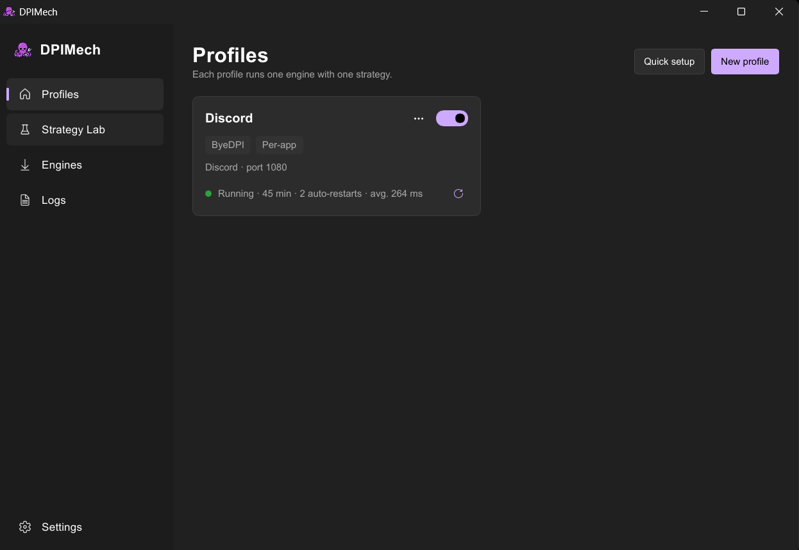
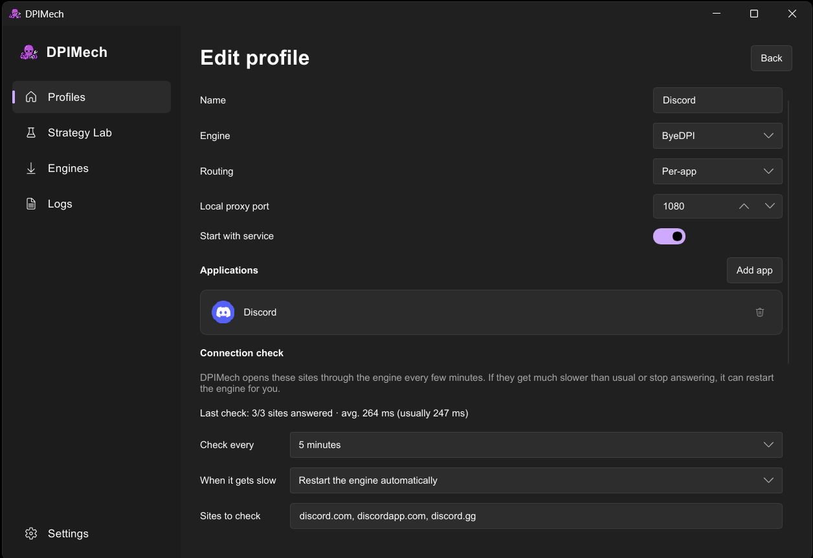
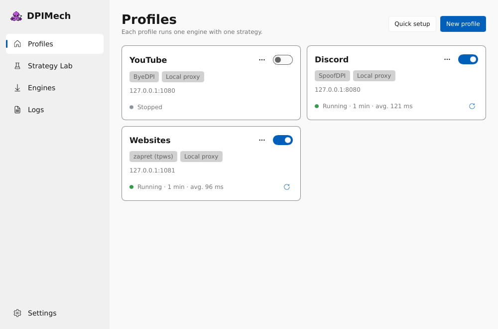
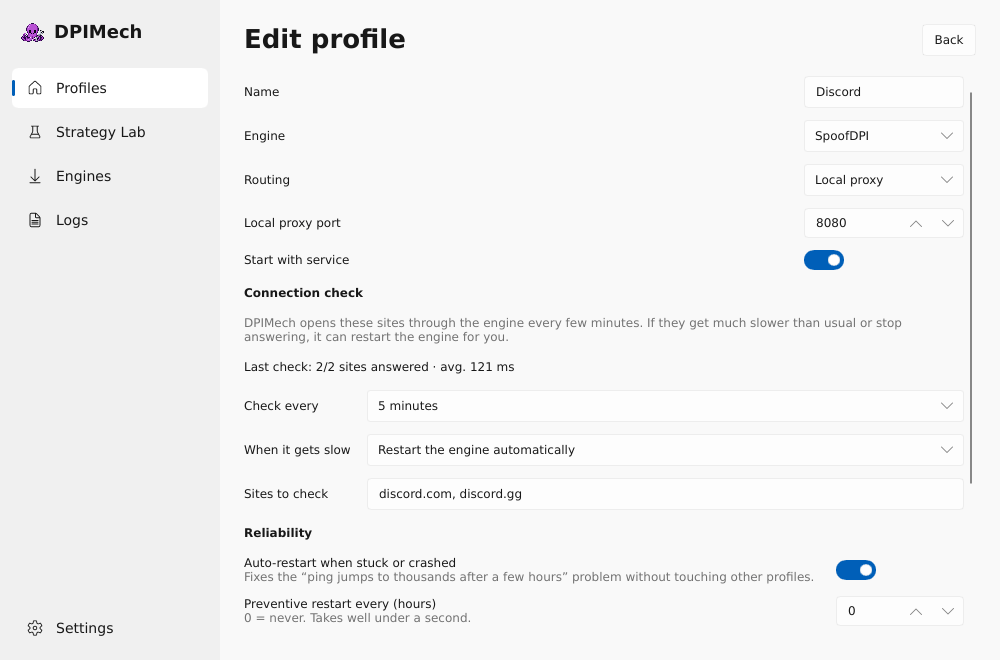

<p align="center"><b>English</b> · <a href="README.tr.md">Türkçe</a> · <a href="README.ru.md">Русский</a></p>

<p align="center"></p>

# DPIMech

**Open blocked sites and apps (Discord, YouTube, …) that your internet provider blocks.**

Some internet providers look inside your traffic and block certain sites. This technique is
called *DPI* (deep packet inspection). DPIMech runs small, well-known open-source tools
("engines") that change how your traffic looks, so the blocking stops working.

> **DPIMech is not a VPN.** Your traffic still goes straight to the site; nothing passes through
> someone else's server. Speed and ping stay the same, but your IP address is not hidden and
> sites that are blocked in another way (for example by IP address) stay blocked.

| | Status |
|---|---|
| **Windows 10 / 11** | Ready. Installer on the [Releases](https://github.com/halilkhrmn/dpimech/releases) page. |
| **Linux** | Ready: `.deb`, `.rpm` and AppImage on the Releases page, Fedora via COPR (see below). |
| **macOS** | Early preview: `.dmg` on the Releases page, local proxy only (see below). |

<p align="center">
  <a href="site/screenshots/windows-profiles.png"></a>
  <a href="site/screenshots/windows-editor.png"></a>
  <br><sub>Windows: profiles and a per-app profile for Discord</sub>
</p>
<p align="center">
  <a href="site/screenshots/linux-profiles.png"></a>
  <a href="site/screenshots/linux-editor.png"></a>
  <br><sub>Linux: profiles running side by side, profile editor</sub>
</p>

## What it does

- **One click on, one click off.** Each *profile* is a ready setup, for example "Discord".
- **Only where you want it.** Only chosen apps, the whole computer, or a local proxy.
- **Finds settings that work for you.** The *Strategy Lab* tries dozens of settings on real sites
  and shows which ones work on your connection. It can detect your internet provider and suggest
  presets made for it (for example Türk Telekom or Superonline).
- **Installs and updates engines for you** from their official GitHub pages, and checks every
  download against its published checksum.
- **Keeps it running.** If an engine gets stuck (for example when Discord's ping suddenly jumps
  to thousands after a few hours), DPIMech restarts it in under a second. A connection check
  shows the average ping on each profile.
- **Shortcuts.** Right-click a profile (or press ⋯) → *Create shortcut*: a desktop or menu icon that
  turns the profile on and then opens the app, for example Discord.
- **Light:** about 25–35 MB of RAM for the window, around 20 MB for the background service.

## Windows

### Getting started

1. **Download and run** `dpimech-setup-<version>.exe` from
   [Releases](https://github.com/halilkhrmn/dpimech/releases). Windows asks for permission once;
   the background service then starts with the computer by itself.
2. **Open DPIMech** and choose **Just make it work**. Pick the sites (for example Discord), where
   it should work (only some apps, the whole computer, or a proxy) and press **Start**.
   DPIMech installs what it needs, tests settings on your connection and turns the best one on.
3. That's it. Later you can press **Quick setup** to add another profile, or switch off
   *Easy mode* in Settings to see engines, the Strategy Lab and logs.

Tip: in **Settings** you can make DPIMech start when you sign in, hidden in the tray.

### Engines on Windows

| Engine | What it is good at | Needs |
|---|---|---|
| **ByeDPI** | A local proxy. Simple and safe. Pair it with ProxiFyre to route only chosen apps. | Nothing extra |
| **ProxiFyre** *(helper)* | Sends only the apps you pick through ByeDPI. | **Windows Packet Filter** driver (installed from the Engines page; a restart may be needed) |
| **zapret (winws)** | Works on the whole computer, also for UDP (Discord voice, QUIC). The most powerful option. | Uses WinDivert (included). Runs through the DPIMech service with administrator rights. |
| **GoodbyeDPI** | The classic whole-computer tool. Simple, but no longer actively developed. | Uses WinDivert (included). Same as above. |

Only **one** WinDivert engine (zapret or GoodbyeDPI) can run at a time. Some antivirus programs
wrongly flag WinDivert; DPIMech downloads it only from the engines' official releases.

## Linux

### Engines on Linux

| Engine | Mode | Needs |
|---|---|---|
| **zapret (nfqws)** | Whole computer. DPIMech adds its own nftables rules while it runs and removes them afterwards. | `nftables`, kernel modules `nft_queue` and `nfnetlink_queue` (standard on most distributions) |
| **zapret (tpws)** | Whole computer, only some apps, or a local SOCKS proxy | Nothing extra (cgroup v2 for "only some apps") |
| **ByeDPI** | Only some apps, or a local SOCKS proxy | Nothing extra (cgroup v2 for "only some apps") |
| **SpoofDPI** | Only some apps, or a local SOCKS proxy. Can resolve names over HTTPS (DoH), which also gets past DNS blocking | Nothing extra |

"Only some apps" and tpws for the whole computer route TCP only; UDP (for example voice)
goes direct. An app's traffic is picked up about a second after it starts.

### Install

Download from [Releases](https://github.com/halilkhrmn/dpimech/releases):

| Your system | File | Install |
|---|---|---|
| Ubuntu, Debian, Mint, Pop!_OS | `dpimech_<version>_amd64.deb` | `sudo apt install ./dpimech_*_amd64.deb` |
| Fedora | nothing to download: the [COPR repository](https://copr.fedorainfracloud.org/coprs/halilkahraman/DPIMech/) | see below |
| openSUSE, RHEL | `dpimech-<version>-1.x86_64.rpm` | `sudo dnf install ./dpimech-*.x86_64.rpm` |
| Any other distribution | `DPIMech-<version>-x86_64.AppImage` | `chmod +x DPIMech-*.AppImage`, then run it |

[](https://copr.fedorainfracloud.org/coprs/halilkahraman/DPIMech/package/dpimech/)

**Fedora** — add the repository once, then updates come with the rest of the system (`sudo dnf upgrade`):

```sh
sudo dnf copr enable halilkahraman/DPIMech
sudo dnf install dpimech
```

The packages (`.deb`, `.rpm`, COPR) also install and start the background service. With the AppImage, open
DPIMech and press **Install the service** once (it asks for your password). The tray icon needs
`libayatana-appindicator` (Arch / CachyOS: `sudo pacman -S libayatana-appindicator`); without it DPIMech
works without a tray icon, and closing the window quits it.

### Build from source

Needs [Rust](https://rustup.rs), `systemd`, and for building the window the GTK 3 and
AppIndicator development packages (on Debian/Ubuntu:
`sudo apt install build-essential libgtk-3-dev libayatana-appindicator3-dev libxkbcommon-x11-0`).

```sh
git clone https://github.com/halilkhrmn/dpimech && cd dpimech
cargo build --release
sudo target/release/dpimech-service install   # background service (systemd unit "dpimech")
target/release/dpimech                         # the window
```

The tray icon needs a desktop with StatusNotifier/AppIndicator support (on GNOME: the
*AppIndicator* extension). Remove the service with `sudo /usr/local/lib/dpimech/dpimech-service uninstall`.

## macOS (early preview)

Download `DPIMech-<version>.dmg` from [Releases](https://github.com/halilkhrmn/dpimech/releases)
and drag DPIMech into Applications. The app is not signed yet: on first start, right-click it and
choose **Open**. Then press **Install the service** once (it asks for your password).

On macOS DPIMech can only run a **local SOCKS proxy** (zapret's tpws) for now; you set
`127.0.0.1:<port>` in your browser or app. Whole-computer and per-app modes are planned. Built
and checked automatically on macOS, but not yet tested by hand on a Mac.

## Good to know

- **Games:** on Windows, games with strict anti-cheat (for example Valorant or FACEIT) may refuse
  to start or disconnect you while a whole-computer engine is on. Turn that profile off before
  playing, or unblock only the apps you need.
- **One DPI tool at a time:** if another bypass tool (GoodbyeDPI, zapret, ByeDPI Manager, …) runs
  next to DPIMech, connections break in strange ways. DPIMech warns you when it sees one.
- **Still blocked? Check your DNS.** Some providers (for example in Turkey) also block sites by
  giving a wrong address for their names; no engine can fix that. The Strategy Lab warns when your
  DNS answers differently from 1.1.1.1. Then set your DNS to `1.1.1.1` / `1.0.0.1` (or turn on
  "DNS over HTTPS" in your system or browser).
- **Logs:** Settings → *Log*. When a profile stops with an error, the recent log is saved to a file
  by itself. *Detailed log* also records every connection (site, address, how it ended) — turn it
  on to find out why something does not open, and attach the file when asking for help.

## Is it safe?

- The engines only change how your own requests look.
- The background service runs with administrator rights because some engines need it. It only
  starts engines from its own protected folder and rejects settings that could write files or
  read private files.
- Checking your internet provider is optional. It happens only when you press
  *Detect my provider*, and it sends your public IP address to `ipwho.is`.

## How it is made

DPIMech is developed with AI assistance (Claude). Features are tested by hand before they are
called done; [docs/PROGRESS.md](docs/PROGRESS.md) records what was tested and how, including what
has not been tested yet.

## Credits

DPIMech only manages these projects; all the real work is theirs:
[ByeDPI](https://github.com/hufrea/byedpi) ·
[zapret](https://github.com/bol-van/zapret) ·
[GoodbyeDPI](https://github.com/ValdikSS/GoodbyeDPI) ·
[WinDivert](https://github.com/basil00/WinDivert) ·
[ProxiFyre](https://github.com/wiresock/proxifyre) ·
[Windows Packet Filter](https://github.com/wiresock/ndisapi).
The Strategy Lab can download strategy lists from
[ByeDPI Manager](https://github.com/romanvht/ByeDPIManager) and
[SplitWire-Turkey](https://github.com/cagritaskn/SplitWire-Turkey).
Icons: [Fluent UI System Icons](https://github.com/microsoft/fluentui-system-icons) (MIT).
Made with [Slint](https://slint.dev).

## License

DPIMech is free software under the [GNU General Public License v3.0 or later](LICENSE): you may
use, share and change it, and anything you distribute that is built on it must stay open under the
same terms. The engines it downloads keep their own licences.

Want to help? See [CONTRIBUTING.md](CONTRIBUTING.md).
