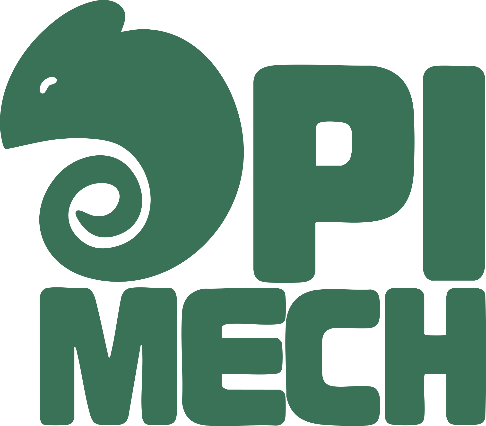

<a href="README.md">English</a> · <a href="README.tr.md">Türkçe</a> · <b>Русский</b> · <a href="README.fa.md">فارسی</a> · <a href="README.ar.md">العربية</a>

<!-- ---------- Заголовок ---------- -->

  
  
Открывает сайты и приложения, которые блокирует ваш провайдер (Discord, YouTube, …). Бесплатно и с открытым кодом, для Windows, Linux и macOS.

  
  
  
  
  

> **DPIMech — не VPN.** Он запускает известные инструменты с открытым кодом, которые меняют вид вашего
> трафика, поэтому глубокая инспекция пакетов (DPI) у провайдера перестаёт его блокировать. Трафик
> по-прежнему идёт напрямую к сайту: пинг не меняется, но ваш IP-адрес не скрывается.

<!-- ---------- Возможности ---------- -->
## Возможности

- [x] Включение и выключение в один клик: готовый *профиль* для сайта или приложения, например Discord
- [x] Только выбранные приложения, весь компьютер или локальный прокси
- [x] *Лаборатория стратегий* находит настройки, которые работают на вашем подключении
- [x] Устанавливает и обновляет движки, каждая загрузка проверяется по контрольной сумме
- [x] Сам перезапускает зависший движок меньше чем за секунду
- [x] Ярлыки на рабочем столе, которые включают профиль и открывают приложение
- [x] English, Türkçe, Русский, فارسی, العربية
- [x] Лёгкий: около 30 МБ памяти для окна и 20 МБ для фоновой службы

<!-- ---------- Скачать ---------- -->
## Скачать

| Система | Как установить |
|---|---|
| **Windows 10 / 11** | `dpimech-setup-<версия>.exe` со страницы [Releases](https://github.com/halilkhrmn/dpimech/releases/latest) |
| **Ubuntu, Debian, Mint** | `.deb` из Releases → `sudo apt install ./dpimech_*_amd64.deb` |
| **Fedora** | `sudo dnf copr enable halilkahraman/DPIMech && sudo dnf install dpimech` |
| **Arch, CachyOS, Manjaro** | `.pkg.tar.zst` из Releases → `sudo pacman -U ./dpimech-bin-*.pkg.tar.zst` |
| **openSUSE, RHEL** | `.rpm` из Releases → `sudo dnf install ./dpimech-*.x86_64.rpm` |
| **Другой Linux** | AppImage из Releases |
| **macOS** *(ранняя версия)* | `.dmg` из Releases |

Затем откройте DPIMech и выберите **Просто сделай, чтобы работало**. Движки, страны, сборка из исходников
и решение проблем — в **[руководстве](docs/guide/ru.md)**.

<!-- ---------- Скриншоты ---------- -->
## Скриншоты

  
  
  
  

<!-- ---------- Участие ---------- -->
## Отзывы и участие

***Любая помощь приветствуется!***

- Ошибки и идеи: [Issues](https://github.com/halilkhrmn/dpimech/issues) или *Сообщить о проблеме* в настройках приложения.
- Код: сделайте fork и откройте pull request; как это сделать, описано в [CONTRIBUTING.md](CONTRIBUTING.md).
- Переводы лежат в [`crates/gui/lang`](crates/gui/lang) в виде обычных файлов `.po`.

## Благодарности

- **Логотип:** автор — [Kim De Vries](https://www.artstation.com/kdevries21), нарисован вручную. ИИ при его создании не использовался.
- DPIMech только управляет этими проектами, вся настоящая работа — их:
  [ByeDPI](https://github.com/hufrea/byedpi) ·
  [zapret](https://github.com/bol-van/zapret) ·
  [GoodbyeDPI](https://github.com/ValdikSS/GoodbyeDPI) ·
  [WinDivert](https://github.com/basil00/WinDivert) ·
  [ProxiFyre](https://github.com/wiresock/proxifyre) ·
  [Windows Packet Filter](https://github.com/wiresock/ndisapi).
- Списки стратегий: [ByeDPI Manager](https://github.com/romanvht/ByeDPIManager),
  [SplitWire-Turkey](https://github.com/cagritaskn/SplitWire-Turkey).
  Иконки: [Fluent UI System Icons](https://github.com/microsoft/fluentui-system-icons). Сделано на [Slint](https://slint.dev).
- Код разрабатывается с помощью ИИ (Claude), каждая функция проверяется вручную;
  что и как проверено, записано в [docs/PROGRESS.md](docs/PROGRESS.md).

## Лицензия

DPIMech — свободное ПО под лицензией [GNU GPL v3.0 или более поздней](LICENSE): его можно использовать,
изучать, распространять и изменять. Загружаемые движки сохраняют свои лицензии.

Сделано с ❤️

